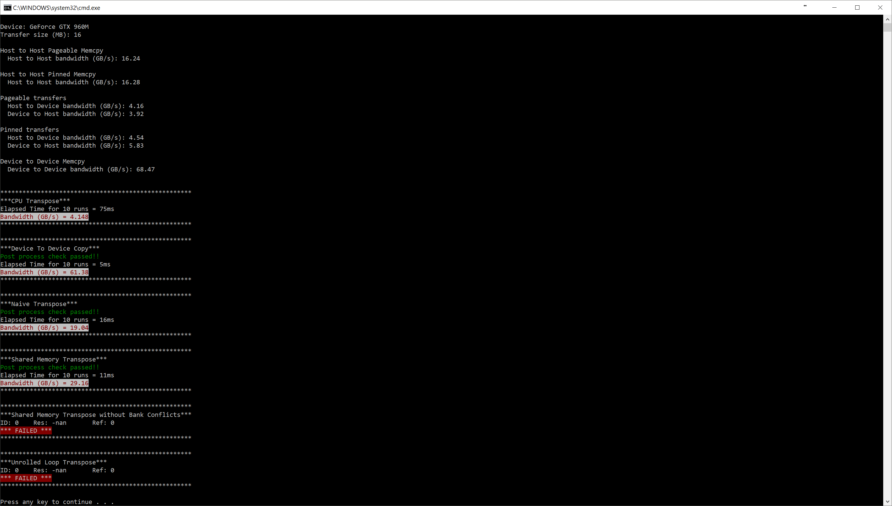

# CIS 565 Performance Lab

This is the second in series of 2 labs for CUDA. In this lab, we will discuss
how NVIDIA's Nsight for Visual Studio and Visual Profiler can aid in debugging
CUDA programs.

**The performance lab will be held in class.**
**Please bring your Windows CUDA-Capable laptop with the code downloaded and built.**
**If you do not have a Windows CUDA-Capable laptop, please find a partner to work with.**

# TODO Before Performance Lab

## Clone, Build and Run
The source code consists of a CMake build structure similar to [Project 0](https://github.com/CIS565-Fall-2017/Project0-CUDA-Getting-Started).
Clone this repository from Github and then run the instructions below.

1. In Git Bash, navigate to your cloned project directory.
2. Create a `build` directory: `mkdir build`
   * (This "out-of-source" build makes it easy to delete the `build` directory
     and try again if something goes wrong with the configuration.)
3. Navigate into that directory: `cd build`
4. Open the CMake GUI to configure the project:
   * `cmake-gui ..` or `"C:\Program Files (x86)\cmake\bin\cmake-gui.exe" ..`
     * Don't forget the `..` part!
   * Click *Configure*.  Select your version of Visual Studio, Win64.
     (**NOTE:** you must use Win64, as we don't provide libraries for Win32.)
   * If you see an error like `CUDA_SDK_ROOT_DIR-NOTFOUND`,
     set `CUDA_SDK_ROOT_DIR` to your CUDA install path. This will be something
     like: `C:/Program Files/NVIDIA GPU Computing Toolkit/CUDA/v8.0`
   * Click *Generate*.
5. If generation was successful, there should now be a Visual Studio solution
   (`.sln`) file in the `build` directory that you just created. Open this.
   (from the command line: `explorer *.sln`)
6. Build. (Note that there are Debug and Release configuration options.)
7. Run. Make sure you run the `transpose` target (not `ALL_BUILD`) by
   right-clicking it and selecting "Set as StartUp Project".
   * If you have switchable graphics (NVIDIA Optimus), you may need to force
     your program to run with only the NVIDIA card. In NVIDIA Control Panel,
     under "Manage 3D Settings," set "Multi-display/Mixed GPU acceleration"
     to "Single display performance mode".

Note:

* If you start running using `F5`, the command prompt will open and close.
    * The `F5` shortcut is *Start Debugging*, which means Visual Studio will
      monitoring your application and it will not run at full performance.
    * Use `F5` only when you are debugging.
* Instead, use `Ctrl+F5` when you want to run without debugging. This will run
  the application at full performance as well as keep the command prompt open
  after the application ends.

Please ask me or the TAs ahead of time if you have trouble compiling the code. We want to be ready to go at the start of the lab.

## Complete Copy Kernel, Naive Transpose and Shared Memory Transpose

* These are exact copies of the kernels we wrote in the Debugging Lab.
* In the interest of time, we will not be covering the code of these during the
  lab. So it is in your best interest to complete the code before the lab.
    * This will also serve as a revision of the Debugging Lab as we will cover
      more advance topics and it will make it easier for you.
* The sections you need to work on are marked by `TODO: COMPLETE THIS`.
    * There are 3 kernels you need to write, and 3 `blocks`/`grids`
      configurations you need to set up.
* Once completed, your output should look like this: 

#### Third Party Code
This repository includes code from [termcolor](https://github.com/ikalnytskyi/termcolor) licensed under the BSD 3 Clause.
